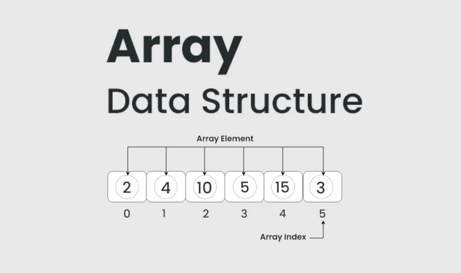

# Arrays in C - Complete Guide

## Table of Contents
- [What is an Array?](#what-is-an-array)
- [Array Fundamentals](#array-fundamentals)
- [Array Declaration and Initialization](#array-declaration-and-initialization)
- [Array Operations](#array-operations)
- [Memory Management Approaches](#memory-management-approaches)
- [Static vs Dynamic Memory Allocation](#static-vs-dynamic-memory-allocation)
- [Implementations in this Repository](#implementations-in-this-repository)
- [Advanced Array Concepts](#advanced-array-concepts)
- [Applications](#applications)
- [When to Use Arrays](#when-to-use-arrays)
- [Best Practices](#best-practices)

## What is an Array?

An **Array** is a collection of elements of the same data type stored in contiguous memory locations. Arrays are one of the most fundamental and widely-used data structures in computer science, serving as the foundation for many other data structures and algorithms.

<div align="center">
  
</div>

### Conceptual Understanding

Think of an array as a **row of mailboxes** in an apartment building:
- Each mailbox has a **unique address** (index)
- All mailboxes are **identical in size** (same data type)
- Mailboxes are **physically adjacent** (contiguous memory)
- You can **directly access** any mailbox if you know its address

### Mathematical Definition

An array A of size n can be mathematically represented as:
```
A = {a[0], a[1], a[2], ..., a[n-1]}
```
Where:
- **A** is the array name
- **n** is the size of the array
- **a[i]** represents the element at index i
- **0 ≤ i < n** (zero-based indexing in C)

### Key Characteristics

| Characteristic | Description | Implication |
|----------------|-------------|-------------|
| **Homogeneous** | All elements are of the same data type | Memory calculations are predictable |
| **Contiguous** | Elements are stored in consecutive memory locations | Enables pointer arithmetic and cache efficiency |
| **Indexed** | Elements can be accessed using their position | O(1) random access time |
| **Fixed Type** | Data type is determined at declaration time | Type safety and memory optimization |
| **Zero-based** | First element is at index 0 (in C) | Mathematical convenience for address calculation |

### Memory Layout

```
Memory Address: 1000  1004  1008  1012  1016
Array Index:      0     1     2     3     4
Array Element:   [25]  [30]  [15]  [40]  [10]
```

In this example with `int arr[5]`:
- Each integer occupies 4 bytes
- Element at index `i` is located at: `base_address + i * sizeof(data_type)`
- Direct address calculation enables O(1) access time

## Array Fundamentals

### Why Arrays Matter

Arrays are crucial in programming because they:

1. **Provide Structure**: Organize related data in a logical manner
2. **Enable Algorithms**: Form the basis for sorting, searching, and mathematical operations
3. **Optimize Memory**: Efficient memory usage through contiguous allocation
4. **Support Iteration**: Easy traversal through loops and iterators
5. **Enable Random Access**: Instant access to any element via indexing

### Array vs Other Data Structures

| Feature | Array | Linked List | Dynamic Array | Hash Table |
|---------|-------|-------------|---------------|------------|
| **Access Time** | O(1) | O(n) | O(1) | O(1) average |
| **Memory Layout** | Contiguous | Scattered | Contiguous blocks | Scattered |
| **Cache Performance** | Excellent | Poor | Good | Variable |
| **Memory Overhead** | Minimal | High (pointers) | Moderate | High |
| **Insertion/Deletion** | O(n) | O(1) at known position | O(n) worst case | O(1) average |

### Array Types in C

#### 1. **One-Dimensional Arrays**
```c
int numbers[10];              // Array of 10 integers
char name[50];                // Array of 50 characters (string)
float prices[100];            // Array of 100 floating-point numbers
```

#### 2. **Multi-Dimensional Arrays**
```c
int matrix[3][4];             // 2D array (3 rows, 4 columns)
char cube[5][5][5];           // 3D array
int tensor[2][3][4][5];       // 4D array
```

#### 3. **Array of Pointers**
```c
int *ptrs[10];                // Array of 10 integer pointers
char *strings[20];            // Array of 20 string pointers
```

#### 4. **Pointer to Array**
```c
int (*ptr)[10];               // Pointer to an array of 10 integers
```

## Array Declaration and Initialization

### Declaration Syntax

```c
data_type array_name[size];
```

### Initialization Methods

#### 1. **At Declaration Time**
```c
// Method 1: Initialize all elements
int arr1[5] = {10, 20, 30, 40, 50};

// Method 2: Partial initialization (remaining elements set to 0)
int arr2[5] = {10, 20};  // arr2 = {10, 20, 0, 0, 0}

// Method 3: Let compiler determine size
int arr3[] = {1, 2, 3, 4, 5};  // Size automatically becomes 5

// Method 4: Initialize all elements to zero
int arr4[100] = {0};

// Method 5: Initialize with non-zero value (C99 and later)
int arr5[10] = {[0 ... 9] = -1};  // GCC extension
```

#### 2. **After Declaration**
```c
int arr[5];
for(int i = 0; i < 5; i++) {
    arr[i] = i * 2;  // arr = {0, 2, 4, 6, 8}
}
```

#### 3. **Using Memory Functions**
```c
#include <string.h>

int arr[100];
memset(arr, 0, sizeof(arr));     // Initialize all to 0
memset(arr, -1, sizeof(arr));    // Initialize all to -1 (careful with data types)
```

### Array Size and Memory Calculation

```c
int arr[10];
printf("Array size: %zu bytes\n", sizeof(arr));        // 40 bytes (10 * 4)
printf("Element size: %zu bytes\n", sizeof(arr[0]));   // 4 bytes
printf("Number of elements: %zu\n", sizeof(arr)/sizeof(arr[0])); // 10

// Useful macro for array length
#define ARRAY_SIZE(arr) (sizeof(arr) / sizeof((arr)[0]))
```

## Array Operations

### Core Operations

| Operation | Description | Time Complexity | Space Complexity | Use Case |
|-----------|-------------|-----------------|------------------|----------|
| **Access** | Retrieve element at given index | O(1) | O(1) | Reading data |
| **Search (Linear)** | Find element by value sequentially | O(n) | O(1) | Unsorted arrays |
| **Search (Binary)** | Find element in sorted array | O(log n) | O(1) | Sorted arrays |
| **Insert** | Add element at specific position | O(n) | O(1) | Data modification |
| **Delete** | Remove element by value/position | O(n) | O(1) | Data removal |
| **Update** | Modify element at given index | O(1) | O(1) | Data modification |
| **Sort** | Arrange elements in order | O(n²) to O(n log n) | O(1) to O(n) | Data organization |
| **Traverse** | Visit all elements sequentially | O(n) | O(1) | Processing all data |

### Detailed Operation Analysis

#### 1. **Array Access**
```c
// Direct access - O(1) time complexity
int value = arr[index];

// Address calculation: base_address + index * sizeof(data_type)
// This mathematical formula enables constant-time access
```

**Why O(1)?** The memory address can be calculated directly using the formula above, regardless of array size.

#### 2. **Array Insertion**
```c
// Insert element at specific position
int insertElement(int arr[], int *n, int pos, int value, int capacity) {
    if(*n >= capacity) {
        printf("Array is full\n");
        return 0;
    }
    
    if(pos < 0 || pos > *n) {
        printf("Invalid position\n");
        return 0;
    }
    
    // Shift elements to the right
    for(int i = *n; i > pos; i--) {
        arr[i] = arr[i-1];
    }
    
    arr[pos] = value;
    (*n)++;
    return 1;
}
```

**Time Complexity Analysis:**
- **Best Case**: O(1) - insertion at end
- **Average Case**: O(n/2) - insertion in middle
- **Worst Case**: O(n) - insertion at beginning

#### 3. **Array Deletion**
```c
// Delete element at specific position
int deleteElement(int arr[], int *n, int pos) {
    if(*n <= 0) {
        printf("Array is empty\n");
        return 0;
    }
    
    if(pos < 0 || pos >= *n) {
        printf("Invalid position\n");
        return 0;
    }
    
    // Shift elements to the left
    for(int i = pos; i < *n - 1; i++) {
        arr[i] = arr[i + 1];
    }
    
    (*n)--;
    return 1;
}
```

## Memory Management Approaches

### 1. **Static Memory Allocation**
- Memory allocated at **compile time**
- Fixed size determined during declaration
- Memory allocated on the **stack**
- Automatic deallocation when out of scope

```c
int arr[100];  // Fixed size of 100 integers
```

### 2. **Dynamic Memory Allocation**
- Memory allocated at **runtime**
- Size can be determined during execution
- Memory allocated on the **heap**
- Manual allocation and deallocation required

```c
int *arr = malloc(n * sizeof(int));  // Size 'n' determined at runtime
```

## Static vs Dynamic Memory Allocation

| Aspect | Static Allocation | Dynamic Allocation |
|--------|------------------|-------------------|
| **Memory Location** | Stack | Heap |
| **Size** | Fixed at compile time | Variable at runtime |
| **Performance** | Faster access | Slightly slower |
| **Memory Management** | Automatic | Manual (malloc/free) |
| **Flexibility** | Limited | High |
| **Memory Waste** | Possible if underutilized | Minimal |
| **Risk** | Stack overflow | Memory leaks |

## Implementations in this Repository

This repository demonstrates both approaches with identical functionality but different memory management strategies:

> Expand to view detailed information about each implementation approach.


<details>
<summary><strong>🔹 Static Array Implementation</strong></summary>

### Overview
This implementation uses a **fixed-size array** with compile-time memory allocation. The array size is limited by the `MAX_SIZE` constant, providing fast access and simple memory management.

### Key Features
- **Fixed Size**: Maximum of 100 elements (configurable via `MAX_SIZE`)
- **Stack Memory**: Uses automatic memory management
- **Global Variables**: `int arr[MAX_SIZE]` and `int n` (current size)
- **Fast Access**: Direct array indexing for O(1) access time
- **No Memory Leaks**: Automatic cleanup when program ends

### Memory Management
```c
#define MAX_SIZE 100
int arr[MAX_SIZE];  // Fixed-size array
int n = 0;          // Current number of elements
```

### Advantages
- ✅ **Fast Performance**: Stack allocation is faster than heap
- ✅ **No Memory Management**: Automatic allocation/deallocation
- ✅ **Simple Implementation**: Straightforward array operations
- ✅ **No Fragmentation**: Contiguous memory allocation
- ✅ **Compile-time Safety**: Size known at compile time

### Disadvantages
- ❌ **Fixed Size Limitation**: Cannot exceed MAX_SIZE elements
- ❌ **Memory Waste**: Unused space if array not fully utilized
- ❌ **Stack Overflow Risk**: Large arrays may cause stack overflow
- ❌ **Inflexibility**: Cannot adapt to runtime requirements

### Use Cases
- **Small to Medium Arrays**: When size requirements are predictable
- **Performance-Critical Applications**: Where speed is paramount
- **Embedded Systems**: Limited memory environments
- **Educational Purposes**: Learning array fundamentals

### Source Code
```c
#include<stdio.h>
#include<stdlib.h>

#define MAX_SIZE 100

int arr[MAX_SIZE];
int n = 0;

void readArray(int size){
    if (size > MAX_SIZE || size <= 0) {
        printf("Invalid array size. Maximum allowed is %d\n", MAX_SIZE);
        n = 0;
        return;
    }
    printf("Enter array elements: ");
    for (int i = 0; i < size; i++) {
        scanf("%d", &arr[i]);
    }
    n = size;
    printf("Array read successfully.\n");
}

void displayArray(){
    if (n == 0){
        printf("Array is empty. Please read array first.\n");
        return;
    }
    printf("Current array: ");
    for (int i = 0; i < n; i++) printf("%d ", arr[i]);
    printf("\n");
}

void insertElement(int element, int position){
    if (n == 0){
        printf("Array is empty. Please read array first.\n");
        return;
    }
    if (n >= MAX_SIZE) {
        printf("Array is full, cannot insert\n");
        return;
    }
    if (!(position > 0 && position <= n + 1)){
        printf("Invalid position\n");
        return;
    }
    for (int i = n; i >= position; i--) arr[i] = arr[i - 1];
    arr[position - 1] = element;
    n++;
    printf("Element %d inserted at position %d successfully.\n", element, position);
}

void deleteElement(int element){
    if (n == 0){
        printf("Array is empty. Nothing to delete.\n");
        return;
    }
    for (int i = 0; i < n; i++){
        if (arr[i] == element){
            for (int j = i; j < n - 1; j++) arr[j] = arr[j + 1]; 
            n--;
            printf("Element %d deleted successfully.\n", element);
            return;
        }
    }
    printf("Element not found\n");
}

void deleteElementIndex(int position){
    if (n == 0){
        printf("Array is empty. Nothing to delete.\n");
        return;
    }
    if (!(position <= n && position >= 1)){
        printf("Position out of bounds\n");
        return;
    }
    int deletedElement = arr[position - 1];
    for (int j = position - 1; j < n - 1; j++) arr[j] = arr[j + 1];  
    n--;
    printf("Element %d at position %d deleted successfully.\n", deletedElement, position);
}

void searchElement(int element){
    if (n == 0){
        printf("Array is empty. Please read array first.\n");
        return;
    }
    int comparisons = 0;
    for (int i = 0; i < n; i++){
        comparisons++;
        if (arr[i] == element){
            printf("Element found at position: %d\n", i + 1);
            printf("Linear Search - Number of comparisons: %d\n", comparisons);
            return;
        }
    }
    printf("Element not found\n");
    printf("Linear Search - Number of comparisons: %d\n", comparisons);
}

void sortArray(){
    if (n == 0){
        printf("Array is empty. Please read array first.\n");
        return;
    }
    int swapped;
    for (int i = 0; i < n-1; i++){
        swapped = 0;
        for (int j = 0; j < n-i-1; j++){
            if (arr[j] > arr[j + 1]){
                int temp = arr[j];
                arr[j] = arr[j + 1];
                arr[j + 1] = temp;
                swapped = 1; 
            }
        }
        if (!swapped) {
            break;
        }
    }
    printf("Array sorted successfully\n");
}

void binarySearchElement(int element){
    if (n == 0){
        printf("Array is empty. Please read array first.\n");
        return;
    }
    sortArray();
    
    printf("Array sorted for binary search: ");
    for (int i = 0; i < n; i++) printf("%d ", arr[i]);
    printf("\n");
    
    int comparisons = 0;
    int left = 0, right = n - 1;
    while (left <= right){
        int mid = left + (right - left) / 2;
        comparisons++;
        if (arr[mid] == element){
            printf("Element found at position: %d (in sorted array)\n", mid + 1);
            printf("Binary Search - Number of comparisons: %d\n", comparisons);
            return;
        }
        if (arr[mid] < element){
            left = mid + 1;
        } else {
            right = mid - 1;
        }
    }
    printf("Element not found\n");
    printf("Binary Search - Number of comparisons: %d\n", comparisons);
}

int main(){
    int choice;
    
    while (1){
        printf("\nEnter operation to perform-\n");
        printf("1. Read Array\n");
        printf("2. Display Array\n");
        printf("3. Insert element\n");
        printf("4. Delete element\n");
        printf("5. Delete element from position\n");
        printf("6. Search element (Linear Search)\n");
        printf("7. Sort Array\n");
        printf("8. Search element (Binary Search)\n");
        printf("9. quit\n");
        printf("Selection: ");
        scanf("%d", &choice);
        
        switch(choice){
            case 1: {
                int size;
                printf("Enter array length: ");
                scanf("%d", &size);
                readArray(size);
                break;
            }
            case 2: 
                displayArray(); 
                break;
            case 3: {
                int element, position;
                printf("Enter element and position to insert: ");
                scanf("%d %d", &element, &position);
                insertElement(element, position);
                break;
            }
            case 4: {
                int element;
                printf("Enter element to remove: ");
                scanf("%d", &element);
                deleteElement(element);
                break;
            }
            case 5: {
                int position;
                printf("Enter the position of the element to delete: ");
                scanf("%d", &position);
                deleteElementIndex(position);
                break;
            }
            case 6: {
                int element;
                printf("Enter the element to search: ");
                scanf("%d", &element);
                searchElement(element);
                break;
            }
            case 7: {
                sortArray();
                break;
            }
            case 8: {
                int element;
                printf("Enter the element to search: ");
                scanf("%d", &element);
                binarySearchElement(element);
                break;
            }
            case 9: {
                return 0;
            }
            default: {
                printf("Invalid input\n");
                break;
            }
        }
    }
}
```

</details>


<details>
<summary><strong>🔹 Dynamic Array Implementation</strong></summary>

### Overview
This implementation uses **dynamic memory allocation** with runtime size determination. The array can grow and shrink as needed using `malloc()`, `realloc()`, and `free()` functions, providing maximum flexibility.

### Key Features
- **Dynamic Size**: Array size determined at runtime
- **Heap Memory**: Uses manual memory management
- **Global Variables**: `int *arr` (pointer) and `int n` (current size)
- **Memory Efficiency**: Allocates only required memory
- **Flexible Resizing**: Can grow/shrink during execution using `realloc()`

### Memory Management
```c
int *arr = NULL;  // Dynamic array pointer
int n = 0;        // Current number of elements

// Allocation
arr = malloc(size * sizeof(int));

// Reallocation
arr = realloc(arr, new_size * sizeof(int));

// Deallocation
free(arr);
```

### Advantages
- ✅ **Unlimited Size**: Only limited by available system memory
- ✅ **Memory Efficiency**: Uses exact amount of memory needed
- ✅ **Runtime Flexibility**: Size can be determined during execution
- ✅ **Dynamic Resizing**: Can grow/shrink as requirements change
- ✅ **Scalability**: Suitable for large datasets

### Disadvantages
- ❌ **Memory Management Complexity**: Manual allocation/deallocation required
- ❌ **Memory Leak Risk**: Forgot to `free()` can cause memory leaks
- ❌ **Slower Access**: Heap allocation slightly slower than stack
- ❌ **Fragmentation**: Heap memory can become fragmented
- ❌ **Runtime Errors**: `malloc()` can fail if memory unavailable

### Use Cases
- **Large Datasets**: When array size is unknown at compile time
- **Memory-Constrained Systems**: Where memory efficiency is crucial
- **Data Structures**: Implementation of dynamic data structures
- **Real-world Applications**: Where input size varies significantly

### Memory Reallocation Strategy
The implementation uses `realloc()` for efficient memory management:

```c
void reAllocate(int mode){
    if (n + mode <= 0) {
        if (arr != NULL) {
            free(arr);
            arr = NULL;
        }
        n = 0;
        return;
    }
    int *temp = (int *) realloc(arr, (n + mode) * sizeof(int));
    if (temp == NULL) {
        printf("Memory Allocation failed\n");
        return;
    }
    arr = temp; 
    n += mode;
}
```

### Source Code
```c
#include<stdio.h>
#include<stdlib.h>

int *arr = NULL;
int n = 0;

void reAllocate(int mode){
    if (n + mode <= 0) {
        if (arr != NULL) {
            free(arr);
            arr = NULL;
        }
        n = 0;
        return;
    }
    int *temp = (int *) realloc(arr, (n + mode) * sizeof(int));
    if (temp == NULL) {
        printf("Memory Allocation failed\n");
        return;
    }
    arr = temp; 
    n += mode;
}

void readArray(int size){
    if (arr != NULL) {
        free(arr);
        arr = NULL;
    }
    if (size <= 0) {
        printf("Invalid array length\n");
        n = 0;
        return;
    }
    arr = (int *) malloc(size * sizeof(int));
    if (arr == NULL){
        printf("Memory Allocation failed\n");
        n = 0;
        return;
    }
    n = size;
    printf("Enter array elements: ");
    for (int i = 0; i < n; i++) scanf("%d", arr + i);
    printf("Array read successfully.\n");
}

void displayArray(){
    if (arr == NULL || n == 0){
        printf("Array is empty. Please read array first.\n");
        return;
    }
    printf("Current array: ");
    for (int i = 0; i < n; i++) printf("%d ", *(arr + i));
    printf("\n");
}

void insertElement(int element, int position){
    if (arr == NULL || n == 0){
        printf("Array is empty. Please read array first.\n");
        return;
    }
    if (!(position > 0 && position <= n + 1)){
        printf("Invalid position\n");
        return;
    }
    reAllocate(1);
    if (arr == NULL) return; 
    for (int i = n - 1; i >= position; i--) {
        *(arr + i) = *(arr + i - 1);
    }
    *(arr + position - 1) = element;
    printf("Element %d inserted at position %d successfully.\n", element, position);
}

void deleteElement(int element){
    if (arr == NULL || n == 0){
        printf("Array is empty. Nothing to delete.\n");
        return;
    }
    for (int i = 0; i < n; i++){
        if (*(arr + i) == element){
            for (int j = i; j < n - 1; j++) {
                *(arr + j) = *(arr + j + 1);
            }
            reAllocate(-1);
            printf("Element %d deleted successfully.\n", element);
            return;
        }
    }
    printf("Element not found\n");
}

void deleteElementIndex(int position){
    if (arr == NULL || n == 0){
        printf("Array is empty. Nothing to delete.\n");
        return;
    }
    if (!(position <= n && position >= 1)){
        printf("Position out of bounds\n");
        return;
    }
    int deletedElement = *(arr + position - 1);
    for (int j = position - 1; j < n - 1; j++) {
        *(arr + j) = *(arr + j + 1);
    }
    reAllocate(-1);
    printf("Element %d at position %d deleted successfully.\n", deletedElement, position);
}

void searchElement(int element){
    if (arr == NULL || n == 0){
        printf("Array is empty. Please read array first.\n");
        return;
    }
    int comparisons = 0;
    for (int i = 0; i < n; i++){
        comparisons++;
        if (*(arr + i) == element){
            printf("Element found at position: %d\n", i + 1);
            printf("Linear Search - Number of comparisons: %d\n", comparisons);
            return;
        }
    }
    printf("Element not found\n");
    printf("Linear Search - Number of comparisons: %d\n", comparisons);
}

void sortArray(){
    if (arr == NULL || n == 0){
        printf("Array is empty. Please read array first.\n");
        return;
    }
    int swapped;
    for (int i = 0; i < n-1; i++){
        swapped = 0; 
        for (int j = 0; j < n-i-1; j++){
            if (*(arr + j) > *(arr + j + 1)){
                int temp = *(arr + j);
                *(arr + j) = *(arr + j + 1);
                *(arr + j + 1) = temp;
                swapped = 1; 
            }
        }
        if (!swapped) {
            break;
        }
    }
    printf("Array sorted successfully\n");
}

void binarySearchElement(int element){
    if (arr == NULL || n == 0){
        printf("Array is empty. Please read array first.\n");
        return;
    }
    sortArray();
    printf("Array sorted for binary search: ");
    for (int i = 0; i < n; i++) printf("%d ", *(arr + i));
    printf("\n");
    int comparisons = 0;
    int left = 0, right = n - 1;
    while (left <= right){
        int mid = left + (right - left) / 2;
        comparisons++;
        if (*(arr + mid) == element){
            printf("Element found at position: %d (in sorted array)\n", mid + 1);
            printf("Binary Search - Number of comparisons: %d\n", comparisons);
            return;
        }
        if (*(arr + mid) < element){
            left = mid + 1;
        } else {
            right = mid - 1;
        }
    }
    printf("Element not found\n");
    printf("Binary Search - Number of comparisons: %d\n", comparisons);
}

int main(){
    int choice;
    while (1){
        printf("\nEnter operation to perform-\n");
        printf("1. Read Array\n");
        printf("2. Display Array\n");
        printf("3. Insert element\n");
        printf("4. Delete element\n");
        printf("5. Delete element from position\n");
        printf("6. Search element (Linear Search)\n");
        printf("7. Sort Array\n");
        printf("8. Search element (Binary Search)\n");
        printf("9. quit\n");
        printf("Selection: ");
        scanf("%d", &choice);
        
        switch(choice){
            case 1: {
                int size;
                printf("Enter array length: ");
                scanf("%d", &size);
                readArray(size);
                break;
            }
            case 2: 
                displayArray(); 
                break;
            case 3: {
                int element, position;
                printf("Enter element and position to insert: ");
                scanf("%d %d", &element, &position);
                insertElement(element, position);
                break;
            }
            case 4: {
                int element;
                printf("Enter element to remove: ");
                scanf("%d", &element);
                deleteElement(element);
                break;
            }
            case 5: {
                int position;
                printf("Enter the position of the element to delete: ");
                scanf("%d", &position);
                deleteElementIndex(position);
                break;
            }
            case 6: {
                int element;
                printf("Enter the element to search: ");
                scanf("%d", &element);
                searchElement(element);
                break;
            }
            case 7: {
                sortArray();
                break;
            }
            case 8: {
                int element;
                printf("Enter the element to search: ");
                scanf("%d", &element);
                binarySearchElement(element);
                break;
            }
            case 9: {
                if (arr != NULL) {
                    free(arr);
                }
                return 0;
            }
            default: {
                printf("Invalid input\n");
                break;
            }
        }
    }
}
```

</details>

## Advanced Array Concepts

### 1. **Multi-Dimensional Arrays**

#### Memory Layout of 2D Arrays
```c
int matrix[3][4];  // 3 rows, 4 columns

// Memory layout (row-major order in C):
// [0][0] [0][1] [0][2] [0][3] [1][0] [1][1] [1][2] [1][3] [2][0] [2][1] [2][2] [2][3]
```

#### Address Calculation for 2D Arrays
```c
// For matrix[i][j] in an array of dimensions [rows][cols]:
// Address = base_address + (i * cols + j) * sizeof(data_type)

int matrix[3][4];
// matrix[1][2] is at: base + (1 * 4 + 2) * sizeof(int) = base + 6 * sizeof(int)
```

#### Dynamic 2D Array Allocation
```c
// Method 1: Array of pointers
int **create2DArray(int rows, int cols) {
    int **arr = malloc(rows * sizeof(int*));
    for(int i = 0; i < rows; i++) {
        arr[i] = malloc(cols * sizeof(int));
    }
    return arr;
}

// Method 2: Single block allocation (better cache performance)
int* create2DArrayFlat(int rows, int cols) {
    return malloc(rows * cols * sizeof(int));
}

// Access element using: arr[i * cols + j]
```

### 2. **Array vs Pointer Relationships**

```c
int arr[10];
int *ptr = arr;  // ptr points to first element

// These are equivalent:
arr[i]     <==> *(arr + i)     <==> *(ptr + i)     <==> ptr[i]
&arr[i]    <==> (arr + i)      <==> (ptr + i)

// Important differences:
sizeof(arr)  // Returns total array size (10 * sizeof(int))
sizeof(ptr)  // Returns pointer size (8 bytes on 64-bit systems)

// arr is not a modifiable lvalue
// arr++;     // ERROR: Cannot modify array name
ptr++;        // OK: Pointer can be modified
```

### 3. **Array Decay**

When an array is passed to a function, it "decays" to a pointer:

```c
void function1(int arr[]);     // Actually receives int*
void function2(int arr[10]);   // Still receives int*, size ignored
void function3(int *arr);      // Explicit pointer parameter

// To preserve array information:
void function4(int arr[], int size);  // Pass size separately

// Or use array references (C++ style, not standard C):
void function5(int (&arr)[10]);  // Fixed-size array reference
```

### 4. **Variable Length Arrays (VLA) - C99**

```c
void processArray(int n) {
    int arr[n];  // Size determined at runtime
    
    // VLA limitations:
    // 1. Cannot be initialized at declaration
    // 2. Cannot be static
    // 3. May cause stack overflow for large sizes
    
    for(int i = 0; i < n; i++) {
        arr[i] = i * 2;
    }
}
```

### 5. **Flexible Array Members - C99**

```c
struct VariableArray {
    int size;
    int data[];  // Flexible array member (must be last)
};

// Allocation:
struct VariableArray *createArray(int n) {
    struct VariableArray *va = malloc(sizeof(struct VariableArray) + 
                                     n * sizeof(int));
    va->size = n;
    return va;
}
```


### Performance Considerations

1. **Cache Performance**: Static arrays often have better cache locality
2. **Memory Overhead**: Dynamic arrays have allocation overhead
3. **Fragmentation**: Heap allocation can lead to memory fragmentation
4. **Speed**: Stack allocation (static) is generally faster than heap allocation

## Applications

### Real-World Use Cases

#### **Static Arrays:**
- **Embedded Systems**: Microcontroller programming with limited memory
- **Real-time Systems**: Predictable memory usage requirements
- **Mathematical Computations**: Fixed-size matrices and vectors
- **Graphics Programming**: Fixed-size buffers for pixel data

#### **Dynamic Arrays:**
- **Database Systems**: Variable-length records and datasets
- **Text Processing**: Documents with unknown length
- **Image Processing**: Images of varying dimensions
- **Web Applications**: User input of variable size

### Programming Applications

- **Algorithm Implementation**: Sorting, searching, graph algorithms
- **Data Structure Foundation**: Building blocks for stacks, queues, lists
- **String Manipulation**: Character arrays for text processing
- **Numerical Computing**: Mathematical operations on datasets


## When to Use Arrays

#### **Arrays are Ideal For:**
- **Random Access**: Need to access elements by index frequently
- **Mathematical Operations**: Matrix calculations, signal processing
- **Memory Efficiency**: Minimal overhead, contiguous allocation
- **Cache Performance**: Sequential access patterns
- **Simple Algorithms**: Basic sorting, searching, and traversal
- **Embedded Systems**: Predictable memory usage

#### **Consider Alternatives When:**
- **Frequent Insertions/Deletions**: Use linked lists or dynamic structures
- **Unknown Size**: Use dynamic arrays or vectors
- **Complex Operations**: Use specialized data structures (trees, graphs)
- **Key-Value Access**: Use hash tables or maps

## Best Practices

- Always validate array bounds before access
- Initialize arrays to prevent garbage values
- Use `const` for read-only array parameters
- Free dynamically allocated memory
- Choose appropriate data types for memory efficiency
- Consider cache-friendly access patterns
- Use appropriate algorithms for your data size
- Handle memory allocation failures gracefully
- Document array size requirements and constraints
- Use static arrays for small, fixed-size data


