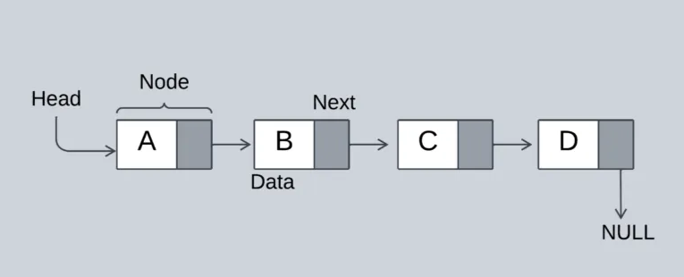

# Singly Linked List Data Structure - Complete Guide

## Table of Contents
- [What is a Linked List?](#what-is-a-linked-list)
- [Linked List Fundamentals](#linked-list-fundamentals)
- [Types of Linked Lists](#types-of-linked-lists)
- [Linked List Operations](#linked-list-operations)
- [Circular Linked List](#circular-linked-list)
- [Doubly Linked List](#doubly-linked-list)
- [Memory Management](#memory-management)
- [Array vs Linked List](#array-vs-linked-list)
- [Advanced Linked List Concepts](#advanced-linked-list-concepts)
- [Applications](#applications)
- [When to Use Linked Lists](#when-to-use-linked-lists)
- [Best Practices](#best-practices)

## What is a Linked List?

A **Linked List** is a linear data structure where elements are stored in nodes, and each node contains a data field and a reference (pointer) to the next node in the sequence. Unlike arrays, linked list elements are not stored in contiguous memory locations.

<div align="center">
  
</div>

### Conceptual Understanding

Think of a linked list as a **chain of railway cars**:
- Each car (node) has **cargo** (data)
- Each car has a **coupling** (pointer) connecting it to the next car
- Cars can be **added or removed** easily without moving others
- You must **traverse from the front** to reach any specific car
- The **last car** has no coupling (NULL pointer)

### Mathematical Definition

A linked list L of size n can be mathematically represented as:
```
L = {node₀, node₁, node₂, ..., node_{n-1}}
```
Where each node has:
```
node_i = {data_i, next_i}
```
Where:
- **L** is the linked list
- **n** is the number of nodes
- **data_i** represents the data stored in node i
- **next_i** is a pointer to node_{i+1} (or NULL if i = n-1)
- **head** points to node₀ (first node)

### Key Characteristics

| Characteristic | Description | Implication |
|----------------|-------------|-------------|
| **Dynamic Size** | Size can grow or shrink at runtime | No fixed capacity constraints |
| **Non-Contiguous** | Nodes scattered in memory | Requires pointer traversal |
| **Node-Based** | Each element is a separate node object | Extra memory for pointers |
| **Sequential Access** | Must traverse from head to reach any node | O(n) access time |
| **Dynamic Allocation** | Nodes created using malloc/new | Manual memory management required |

### Memory Layout

```
Array Memory Layout (Contiguous):
Memory Address: 1000  1004  1008  1012  1016
Array Index:      0     1     2     3     4
Array Element:   [10]  [20]  [30]  [40]  [50]

Linked List Memory Layout (Scattered):
Node 1: [10 | 2004] @ Address 1000
Node 2: [20 | 3008] @ Address 2004
Node 3: [30 | 4012] @ Address 3008
Node 4: [40 | 5016] @ Address 4012
Node 5: [50 | NULL] @ Address 5016

head → 1000 (points to first node)
```

In this example with nodes containing integers:
- Each node contains **data** (integer value) and **next pointer** (address of next node)
- Nodes can be **anywhere in memory** (not necessarily consecutive)
- Traversal requires **following pointers**: head → node₁ → node₂ → ... → nodeₙ
- **Last node** has next = NULL, indicating end of list

## Linked List Fundamentals

### Node Structure

```c
// Single Linked List Node
struct Node {
    int data;              // Data field
    struct Node *next;     // Pointer to next node
};

// Doubly Linked List Node
struct DNode {
    int data;              // Data field
    struct DNode *prev;    // Pointer to previous node
    struct DNode *next;    // Pointer to next node
};
```

### Memory Representation

```
For a single linked list with 3 nodes:

Memory:  [1000: data=10, next=2000]  [2000: data=20, next=3000]  [3000: data=30, next=NULL]
         ↑                            ↑                            ↑
Address: 1000                         2000                         3000

head → [1000]
```

### Why Linked Lists Matter

1. **Dynamic Size**: No need to specify size beforehand
2. **Efficient Insertion/Deletion**: O(1) when position is known
3. **Memory Efficiency**: No wasted memory from unused array elements
4. **Implementation Flexibility**: Base for other data structures (stacks, queues, graphs)
5. **No Reallocation**: Unlike arrays, no need to copy entire structure when growing

## Types of Linked Lists

Understanding different types of linked lists helps in choosing the right structure for specific use cases.

### 1. **Singly Linked List**

A **Singly Linked List** is the simplest form where each node contains data and a pointer to the next node only.

#### Structure Definition
```c
struct Node {
    int data;              // Data field
    struct Node *next;     // Pointer to next node
};
```

#### Characteristics
- **Unidirectional**: Can only traverse forward (head to tail)
- **Single Pointer**: Each node has one pointer to next node
- **Memory Efficient**: Minimal pointer overhead (one pointer per node)
- **Simple Operations**: Straightforward implementation of basic operations

#### Visual Representation
```
head → [10|•] → [20|•] → [30|•] → [40|NULL]
```

#### **Advantages**
- **Memory Efficiency**: Only one pointer per node
- **Simple Implementation**: Easy to understand and code
- **Forward Traversal**: Efficient for sequential forward access
- **Dynamic Insertion**: Easy to add nodes without shifting

#### **Disadvantages**
- **No Backward Traversal**: Cannot move backwards in the list
- **Inefficient Deletion**: Requires traversal to find previous node
- **No Direct Access**: Must traverse from head to reach any position

### 2. **Doubly Linked List**

A **Doubly Linked List** has nodes with pointers to both next and previous nodes.

#### Structure Definition
```c
struct Node {
    int data;
    struct Node *next;     // Pointer to next node
    struct Node *prev;     // Pointer to previous node
};
```

#### Visual Representation
```
head ⇄ [NULL|10|•] ⇄ [•|20|•] ⇄ [•|30|•] ⇄ [•|40|NULL]
```

#### **Advantages**
- **Bidirectional Traversal**: Can move forward and backward
- **Easier Deletion**: Direct access to previous node
- **Reverse Traversal**: Efficient backward iteration

#### **Disadvantages**
- **More Memory**: Extra pointer per node
- **Complex Implementation**: More pointers to manage
- **Extra Operations**: More pointer updates during insertion/deletion

### 3. **Circular Linked List**

A **Circular Linked List** where the last node points back to the first node, forming a circle.

#### Structure Definition
```c
struct Node {
    int data;
    struct Node *next;     // Last node points to head
};
```

#### Visual Representation
```
    ┌───────────────────────────┐
    ↓                           |
head → [10|•] → [20|•] → [30|•] → [40|•]
```

#### **Advantages**
- **No NULL Pointers**: Every node has a valid next pointer
- **Circular Traversal**: Can traverse entire list from any node
- **Useful for Round-Robin**: Perfect for cyclic operations

#### **Disadvantages**
- **Infinite Loop Risk**: Easy to create infinite loops if not careful
- **Complex Termination**: Need special handling to detect end of traversal
- **More Complex Operations**: Insertion and deletion require special care

### 4. **Circular Doubly Linked List**

Combines features of both doubly and circular linked lists.

#### Structure Definition
```c
struct Node {
    int data;
    struct Node *next;     // Last node points to head
    struct Node *prev;     // First node prev points to last
};
```

#### **Advantages**
- **Complete Flexibility**: Traverse in both directions infinitely
- **Optimal for Certain Algorithms**: Music playlists, browser history

#### **Disadvantages**
- **Maximum Complexity**: Most complex to implement and maintain
- **Highest Memory**: Two pointers per node plus circular references

## Linked List Operations

### Core Operations

| Operation | Description | Time Complexity | Space Complexity | Use Case |
|-----------|-------------|-----------------|------------------|----------|
| **Insert at Beginning** | Add node at start | O(1) | O(1) | Stack operations, prepending |
| **Insert at End** | Add node at tail | O(n) | O(1) | Queue operations, appending |
| **Insert at Position** | Add node at specific position | O(n) | O(1) | General insertion |
| **Delete from Beginning** | Remove first node | O(1) | O(1) | Stack pop, dequeue |
| **Delete from End** | Remove last node | O(n) | O(1) | Removing tail |
| **Delete at Position** | Remove node at specific position | O(n) | O(1) | General deletion |
| **Search** | Find node with specific value | O(n) | O(1) | Data retrieval |
| **Traverse** | Visit all nodes | O(n) | O(1) | Display, processing |
| **Reverse** | Reverse the entire list | O(n) | O(1) | List manipulation |
| **Count Nodes** | Calculate list length | O(n) | O(1) | Size information |

### Detailed Operation Analysis

#### 1. **Insert at Beginning**

**Algorithm:**
```c
void insertAtBeginning(struct Node **head, int value) {
    // 1. Allocate memory for new node
    struct Node* newNode = malloc(sizeof(struct Node));
    
    // 2. Check allocation success
    if (newNode == NULL) {
        printf("Memory allocation failed!\n");
        return;
    }
    
    // 3. Assign data
    newNode->data = value;
    
    // 4. Point new node to current head
    newNode->next = *head;
    
    // 5. Update head to new node
    *head = newNode;
}
```

**Time Complexity Analysis:**
- **Best Case**: O(1) - Direct pointer manipulation
- **Average Case**: O(1) - No traversal required
- **Worst Case**: O(1) - Always constant time

**Space Complexity**: O(1) - Only one new node allocated

**Visual Example:**
```
Before: head → [20|•] → [30|NULL]
After:  head → [10|•] → [20|•] → [30|NULL]
                ↑ New node inserted
```

**Why O(1)?** 
- No traversal needed
- Only pointer assignments
- Works regardless of list size

#### 2. **Insert at End**

**Algorithm:**
```c
void insertAtEnd(struct Node **head, int value) {
    // 1. Allocate and initialize new node
    struct Node* newNode = malloc(sizeof(struct Node));
    if (newNode == NULL) return;
    newNode->data = value;
    newNode->next = NULL;
    
    // 2. Handle empty list
    if (*head == NULL) {
        *head = newNode;
        return;
    }
    
    // 3. Traverse to last node
    struct Node *temp = *head;
    while (temp->next != NULL) {
        temp = temp->next;
    }
    
    // 4. Link last node to new node
    temp->next = newNode;
}
```

**Time Complexity Analysis:**
- **Best Case**: O(1) - Empty list (special case)
- **Average Case**: O(n) - Must traverse entire list
- **Worst Case**: O(n) - Traverse n nodes

**Space Complexity**: O(1) - One new node

**Visual Example:**
```
Before: head → [10|•] → [20|NULL]
After:  head → [10|•] → [20|•] → [30|NULL]
                               ↑ New node appended
```

**Why O(n)?**
- Must traverse from head to last node
- No direct access to tail (in basic singly linked list)
- Time proportional to list length

**Optimization**: Maintain a **tail pointer** to achieve O(1) insertion at end:
```c
struct LinkedList {
    struct Node *head;
    struct Node *tail;  // Points to last node
};
```

#### 3. **Insert at Position k**

**Algorithm:**
```c
void insertAtPosition(struct Node **head, int value, int k) {
    // 1. Validate position
    if (k <= 0) {
        printf("Invalid position!\n");
        return;
    }
    
    // 2. Handle insertion at beginning
    if (k == 1) {
        insertAtBeginning(head, value);
        return;
    }
    
    // 3. Allocate new node
    struct Node* newNode = malloc(sizeof(struct Node));
    if (newNode == NULL) return;
    newNode->data = value;
    
    // 4. Traverse to (k-1)th node
    struct Node *temp = *head;
    for (int i = 1; i < k - 1 && temp != NULL; i++) {
        temp = temp->next;
    }
    
    // 5. Validate position exists
    if (temp == NULL) {
        printf("Position out of bounds\n");
        free(newNode);
        return;
    }
    
    // 6. Insert node
    newNode->next = temp->next;
    temp->next = newNode;
}
```

**Time Complexity Analysis:**
- **Best Case**: O(1) - k = 1 (insert at beginning)
- **Average Case**: O(k) - Traverse to position k
- **Worst Case**: O(n) - k = n (insert at end)

**Space Complexity**: O(1) - One new node

**Visual Example:**
```
Insert 25 at position 3:

Before: head → [10|•] → [20|•] → [30|NULL]
                         ↑
                   Position 2 (k-1)

Step 1: newNode = [25|•]
Step 2: newNode->next = temp->next (points to 30)
Step 3: temp->next = newNode

After:  head → [10|•] → [20|•] → [25|•] → [30|NULL]
                                  ↑
                            Position 3
```

#### 4. **Delete from Beginning**

**Algorithm:**
```c
void deleteFromBeginning(struct Node **head) {
    // 1. Check empty list
    if (*head == NULL) {
        printf("List is empty!\n");
        return;
    }
    
    // 2. Store current head
    struct Node *temp = *head;
    
    // 3. Move head to next node
    *head = (*head)->next;
    
    // 4. Free old head
    free(temp);
}
```

**Time Complexity**: O(1) - Direct pointer manipulation

**Space Complexity**: O(1) - No extra space

**Visual Example:**
```
Before: head → [10|•] → [20|•] → [30|NULL]
                ↑ Delete this

After:  head → [20|•] → [30|NULL]
```

#### 5. **Delete from End**

**Algorithm:**
```c
void deleteFromEnd(struct Node **head) {
    // 1. Check empty list
    if (*head == NULL) {
        printf("List is empty!\n");
        return;
    }
    
    // 2. Handle single node
    if ((*head)->next == NULL) {
        free(*head);
        *head = NULL;
        return;
    }
    
    // 3. Traverse to second-last node
    struct Node *temp = *head;
    while (temp->next->next != NULL) {
        temp = temp->next;
    }
    
    // 4. Free last node and update pointer
    free(temp->next);
    temp->next = NULL;
}
```

**Time Complexity**: O(n) - Must traverse to second-last node

**Space Complexity**: O(1) - No extra space

**Visual Example:**
```
Before: head → [10|•] → [20|•] → [30|NULL]
                         ↑           ↑
                  Second-last     Delete this

After:  head → [10|•] → [20|NULL]
```

**Why O(n)?**
- In singly linked list, we need previous node to update its next pointer
- Must traverse entire list to find second-last node
- **Solution**: Use doubly linked list for O(1) deletion from end

#### 6. **Search Element**

**Algorithm:**
```c
int search(struct Node *head, int value) {
    int position = 1;
    
    // Traverse list
    while (head != NULL) {
        // Check if current node matches
        if (head->data == value) {
            return position;
        }
        head = head->next;
        position++;
    }
    
    return -1;  // Not found
}
```

**Time Complexity:**
- **Best Case**: O(1) - Element at first position
- **Average Case**: O(n/2) - Element in middle
- **Worst Case**: O(n) - Element at end or not present

**Space Complexity**: O(1) - No extra space

**Visual Example:**
```
Search for 30:

head → [10|•] → [20|•] → [30|•] → [40|NULL]
  ↓       ↓       ↓        ↓
Check  Check  Check   FOUND at position 3
```

#### 7. **Reverse Linked List**

**Algorithm (Iterative):**
```c
void reverse(struct Node **head) {
    struct Node *prev = NULL;
    struct Node *current = *head;
    struct Node *next = NULL;
    
    while (current != NULL) {
        // Store next node
        next = current->next;
        
        // Reverse current node's pointer
        current->next = prev;
        
        // Move pointers one position ahead
        prev = current;
        current = next;
    }
    
    // Update head to new first node
    *head = prev;
}
```

**Time Complexity**: O(n) - Single traversal through all nodes

**Space Complexity**: O(1) - Only three pointers used

**Visual Step-by-Step Example:**
```
Initial: head → [10|•] → [20|•] → [30|NULL]

Step 1: prev=NULL, current=10, next=20
        NULL ← [10|•]   [20|•] → [30|NULL]
               prev   current

Step 2: prev=10, current=20, next=30
        NULL ← [10|•] ← [20|•]   [30|NULL]
                      prev   current

Step 3: prev=20, current=30, next=NULL
        NULL ← [10|•] ← [20|•] ← [30|•]
                              prev   current

Step 4: current=NULL, prev=30
        head → [30|•] → [20|•] → [10|NULL]
               ↑ New head
```

**Recursive Approach:**
```c
struct Node* reverseRecursive(struct Node* head) {
    // Base case
    if (head == NULL || head->next == NULL) {
        return head;
    }
    
    // Recursive call
    struct Node* newHead = reverseRecursive(head->next);
    
    // Reverse the link
    head->next->next = head;
    head->next = NULL;
    
    return newHead;
}
```

**Recursive Time Complexity**: O(n) - Each node visited once
**Recursive Space Complexity**: O(n) - Call stack for n recursive calls

#### 8. **Traverse/Display**

**Algorithm:**
```c
void display(struct Node *head) {
    if (head == NULL) {
        printf("List is empty\n");
        return;
    }
    
    printf("List: ");
    while (head != NULL) {
        printf("%d", head->data);
        if (head->next != NULL) {
            printf(" -> ");
        }
        head = head->next;
    }
    printf("\n");
}
```

**Time Complexity**: O(n) - Visit every node once

**Space Complexity**: O(1) - No extra space (ignoring output buffer)

## Circular Linked List

### Structure and Properties

In a circular linked list:
- The last node points back to the first node instead of NULL
- Forms a circular chain
- Can maintain pointer to last node for O(1) insertion at both ends

```c
struct Node {
    int data;
    struct Node *next;
};

// Circular list representation:
// head->next->next->...->next == head
```

### Visual Representation

```
        head
         ↓
    [10 | •]────────┐
         ↑          ↓
    [40 | •]   [20 | •]
         ↑          ↓
         └────[30 | •]
```

### Key Operations

#### **1. Insertion at Position k**

```c
void insertAtK(struct Node **head, int value, int k) {
    struct Node *newNode = malloc(sizeof(struct Node));
    newNode->data = value;
    
    // Empty list
    if (*head == NULL) {
        newNode->next = newNode;  // Point to itself
        *head = newNode;
        return;
    }
    
    // Insert at beginning (k <= 1)
    if (k <= 1) {
        struct Node *last = *head;
        while (last->next != *head)  // Find last node
            last = last->next;
        newNode->next = *head;
        last->next = newNode;
        *head = newNode;
        return;
    }
    
    // Insert at position k
    struct Node *temp = *head;
    for (int i = 1; i < k - 1 && temp->next != *head; i++)
        temp = temp->next;
    
    newNode->next = temp->next;
    temp->next = newNode;
}
```

**Time Complexity:**
- Insert at beginning: O(n) - need to find last node
- Insert at position k: O(k)
- Insert after a given node: O(1)

#### **2. Deletion from Position k**

```c
void deleteFromK(struct Node **head, int k) {
    if (*head == NULL) return;
    
    struct Node *temp = *head;
    
    // Delete first node (k <= 1)
    if (k <= 1) {
        // Only one node
        if (temp->next == temp) {
            free(temp);
            *head = NULL;
            return;
        }
        
        // Find last node
        struct Node *last = *head;
        while (last->next != *head)
            last = last->next;
        
        last->next = temp->next;
        *head = temp->next;
        free(temp);
        return;
    }
    
    // Find node before kth position
    for (int i = 1; i < k - 1 && temp->next != *head; i++)
        temp = temp->next;
    
    if (temp->next == *head) return;  // Position out of bounds
    
    struct Node *del = temp->next;
    temp->next = del->next;
    free(del);
}
```

#### **3. Display and Search**

```c
// Display all nodes
void display(struct Node *head) {
    if (!head) return;
    struct Node *temp = head;
    do {
        printf("%d -> ", temp->data);
        temp = temp->next;
    } while (temp != head);
    printf("(back to head)\n");
}

// Search for a value
void search(struct Node *head, int value) {
    if (!head) return;
    struct Node *temp = head;
    int pos = 1;
    do {
        if (temp->data == value) {
            printf("Found at position %d\n", pos);
            return;
        }
        temp = temp->next;
        pos++;
    } while (temp != head);
    printf("Not found\n");
}
```

### Advantages of Circular Linked List

1. ✅ **Round-Robin Scheduling**: Natural fit for circular operations
2. ✅ **Efficient Queue Implementation**: Can access both ends quickly
3. ✅ **No NULL Checks**: No need to check for NULL in traversal
4. ✅ **Symmetric Structure**: Any node can be starting point
5. ✅ **Continuous Traversal**: Can cycle through list indefinitely

### Disadvantages

1. ❌ **Infinite Loop Risk**: Must be careful with termination conditions
2. ❌ **Complex Implementation**: More care needed than simple linked list
3. ❌ **Beginning Insertion Cost**: O(n) to find last node

## Doubly Linked List

### Structure and Properties

A doubly linked list allows bidirectional traversal:
- Each node has **prev** and **next** pointers
- Can traverse forward and backward
- Easier deletion (don't need to track previous node)

```c
struct Node {
    int data;
    struct Node *prev;
    struct Node *next;
};
```

### Visual Representation

```
NULL ← [prev|10|next] ⇄ [prev|20|next] ⇄ [prev|30|next] → NULL
       ↑
      head
```

### Key Operations

#### **1. Insertion at Position k**

```c
void insertAtK(struct Node **head, int value, int k) {
    struct Node *newNode = malloc(sizeof(struct Node));
    newNode->data = value;
    newNode->prev = newNode->next = NULL;
    
    // Insert at beginning or empty list
    if (k <= 1 || *head == NULL) {
        newNode->next = *head;
        if (*head) 
            (*head)->prev = newNode;
        *head = newNode;
        return;
    }
    
    // Find position
    struct Node *temp = *head;
    for (int i = 1; i < k - 1 && temp->next; i++)
        temp = temp->next;
    
    // Insert after temp
    newNode->next = temp->next;
    newNode->prev = temp;
    if (temp->next) 
        temp->next->prev = newNode;
    temp->next = newNode;
}
```

**Time Complexity:** O(k) to reach position k

#### **2. Deletion from Position k**

```c
void deleteFromK(struct Node **head, int k) {
    if (*head == NULL) return;
    
    struct Node *temp = *head;
    
    // Delete first node
    if (k <= 1) {
        *head = temp->next;
        if (*head) 
            (*head)->prev = NULL;
        free(temp);
        return;
    }
    
    // Find kth node
    for (int i = 1; i < k && temp; i++)
        temp = temp->next;
    
    if (!temp) return;  // Position out of bounds
    
    // Adjust pointers
    if (temp->prev) 
        temp->prev->next = temp->next;
    if (temp->next) 
        temp->next->prev = temp->prev;
    free(temp);
}
```

**Time Complexity:** O(k) to reach position k

#### **3. Display and Search**

```c
// Display forward
void displayForward(struct Node *head) {
    while (head) {
        printf("%d", head->data);
        if (head->next) printf(" ⇄ ");
        head = head->next;
    }
    printf("\n");
}

// Display backward
void displayReverse(struct Node *head) {
    if (!head) return;
    
    // Go to end
    while (head->next)
        head = head->next;
    
    // Print backward
    while (head) {
        printf("%d", head->data);
        if (head->prev) printf(" ⇄ ");
        head = head->prev;
    }
    printf("\n");
}

// Search
void searchDoubly(struct Node *head, int value) {
    int pos = 1;
    while (head) {
        if (head->data == value) {
            printf("Found at position %d\n", pos);
            return;
        }
        head = head->next;
        pos++;
    }
    printf("Not found\n");
}
```

### Advantages of Doubly Linked List

1. ✅ **Bidirectional Traversal**: Can move forward and backward
2. ✅ **Easier Deletion**: Don't need to track previous node
3. ✅ **Efficient Reverse Operations**: Natural backward movement
4. ✅ **Better for Complex Operations**: Easier to implement certain algorithms
5. ✅ **No Need for Previous Pointer**: Already have prev reference

### Disadvantages

1. ❌ **Extra Memory**: Requires additional pointer per node
2. ❌ **Complex Operations**: More pointer manipulation needed
3. ❌ **Maintenance Overhead**: Must update both prev and next pointers

## Memory Management

### Dynamic Memory Allocation

Linked lists rely heavily on dynamic memory allocation for creating and destroying nodes.

#### **Node Creation**
```c
// Allocate memory for new node
struct Node* newNode = (struct Node*)malloc(sizeof(struct Node));

// Always check if allocation succeeded
if (newNode == NULL) {
    fprintf(stderr, "Memory allocation failed!\n");
    exit(EXIT_FAILURE);
}

// Initialize node
newNode->data = value;
newNode->next = NULL;
```

#### **Node Deletion**
```c
// Proper deletion sequence:
// 1. Ensure node is not NULL
if (node != NULL) {
    // 2. Update pointers before freeing
    // (make sure no other pointer references this node)
    
    // 3. Free the memory
    free(node);
    
    // 4. Set pointer to NULL (good practice)
    node = NULL;
}
```

#### **Common Memory Issues**

| Issue | Description | Prevention |
|-------|-------------|------------|
| **Memory Leak** | Forgetting to free deleted nodes | Always free nodes when removing |
| **Dangling Pointer** | Pointer to freed memory | Set pointers to NULL after free |
| **Double Free** | Freeing same memory twice | Check for NULL before freeing |
| **Use After Free** | Accessing freed memory | Never use pointer after freeing |
| **NULL Pointer Dereference** | Accessing NULL pointer | Always check for NULL |

#### **Memory Cleanup**
```c
// Free entire linked list
void freeList(struct Node **head) {
    struct Node *current = *head;
    struct Node *next;
    
    while (current != NULL) {
        next = current->next;  // Store next before freeing
        free(current);         // Free current node
        current = next;        // Move to next
    }
    
    *head = NULL;  // Set head to NULL
}
```

### Memory Comparison

```
Array Memory:
- Single malloc: malloc(n * sizeof(int))
- Contiguous block
- Fixed size allocated upfront
- Total: n * sizeof(int) bytes

Linked List Memory:
- Multiple malloc: n calls to malloc(sizeof(struct Node))
- Scattered blocks
- Dynamic size grows as needed
- Total: n * (sizeof(int) + sizeof(pointer)) bytes
- Overhead: n * sizeof(pointer) extra bytes
```

## Array vs Linked List

### Performance Comparison

| Operation | Array | Linked List | Winner |
|-----------|-------|-------------|--------|
| **Access by Index** | O(1) | O(n) | Array |
| **Search Unsorted** | O(n) | O(n) | Tie |
| **Search Sorted** | O(log n) | O(n) | Array |
| **Insert at Beginning** | O(n) | O(1) | Linked List |
| **Insert at End** | O(1)* | O(n)** | Array* |
| **Insert at Middle** | O(n) | O(n) | Tie |
| **Delete at Beginning** | O(n) | O(1) | Linked List |
| **Delete at End** | O(1) | O(n) | Array |
| **Delete at Middle** | O(n) | O(n) | Tie |
| **Memory Usage** | Compact | Extra pointers | Array |
| **Cache Performance** | Excellent | Poor | Array |

*With dynamic array (amortized O(1))
**O(1) with tail pointer

### Memory Layout Comparison

```
Array: Contiguous Memory
[10][20][30][40][50]  ← All elements adjacent
 ↑   Better cache locality
 ↑   Direct index calculation: base + index * size

Linked List: Scattered Memory
[10,ptr] → [20,ptr] → [30,ptr] → [40,ptr] → [50,NULL]
    ↑         ↑         ↑         ↑         ↑
  @1000    @3500    @2100    @5000    @4200
  Random memory locations, poor cache performance
```

### Feature Comparison

| Feature | Array | Linked List |
|---------|-------|-------------|
| **Size** | Fixed (static) or resizable (dynamic) | Dynamic by nature |
| **Memory** | Contiguous allocation | Scattered allocation |
| **Access Pattern** | Random access O(1) | Sequential access O(n) |
| **Insertion Cost** | Expensive (shifting) | Cheap (pointer update) |
| **Deletion Cost** | Expensive (shifting) | Cheap (pointer update) |
| **Memory Overhead** | Minimal | Pointer per element |
| **Cache Friendly** | Yes | No |
| **Implementation** | Simple | More complex |
| **Memory Waste** | Possible (unused capacity) | Minimal |

### When to Choose Array

✅ **Use Array When:**
- Frequent random access by index is needed
- Memory locality and cache performance are critical
- The size is known and relatively fixed
- Memory overhead must be minimal
- Binary search or other index-based algorithms are required

### When to Choose Linked List

✅ **Use Linked List When:**
- Frequent insertions and deletions at beginning/middle
- Size is highly unpredictable and changes frequently
- No need for random access
- Memory fragmentation is acceptable
- Implementing stacks, queues, or graphs

### **Operations Complexity Comparison**

| Operation | Singly | Doubly | Circular | Array |
|-----------|--------|--------|----------|-------|
| **Access by Index** | O(n) | O(n) | O(n) | O(1) |
| **Search** | O(n) | O(n) | O(n) | O(n) |
| **Insert at Beginning** | O(1) | O(1) | O(n)* | O(n) |
| **Insert at End** | O(n) | O(n) | O(1)† | O(1) |
| **Insert at Position k** | O(k) | O(k) | O(k) | O(n) |
| **Delete from Beginning** | O(1) | O(1) | O(n)* | O(n) |
| **Delete from End** | O(n) | O(n) | O(n) | O(1) |
| **Delete from Position k** | O(k) | O(k) | O(k) | O(n) |
| **Reverse** | O(n) | O(n) | O(n) | O(n) |

\* O(n) if maintaining pointer to head only; O(1) if maintaining tail pointer  
† O(1) if maintaining pointer to last node

### **Type Comparison Summary**

| Aspect | Singly | Doubly | Circular |
|--------|--------|--------|----------|
| **Memory/Node** | 1 pointer | 2 pointers | 1 pointer |
| **Traversal** | Forward only | Both directions | Forward (circular) |
| **Deletion** | Need previous | Easy (have prev) | Need previous |
| **Complexity** | Low | High | Medium |
| **Use Cases** | Simple lists | Navigation | Round-robin |

## Advanced Linked List Concepts

### 1. **Detecting Cycles (Floyd's Algorithm)**

A cycle exists when a node's next pointer points back to a previous node.

```c
int hasCycle(struct Node *head) {
    struct Node *slow = head;
    struct Node *fast = head;
    
    while (fast != NULL && fast->next != NULL) {
        slow = slow->next;          // Move one step
        fast = fast->next->next;    // Move two steps
        
        if (slow == fast) {
            return 1;  // Cycle detected
        }
    }
    
    return 0;  // No cycle
}
```

**Time Complexity**: O(n)
**Space Complexity**: O(1)

**How It Works:**
- Slow pointer moves 1 step at a time
- Fast pointer moves 2 steps at a time
- If there's a cycle, fast will eventually catch up to slow
- If no cycle, fast will reach NULL

### 2. **Finding Middle Element**

```c
struct Node* findMiddle(struct Node *head) {
    struct Node *slow = head;
    struct Node *fast = head;
    
    while (fast != NULL && fast->next != NULL) {
        slow = slow->next;
        fast = fast->next->next;
    }
    
    return slow;  // Slow is at middle
}
```

**Time Complexity**: O(n)
**Space Complexity**: O(1)

### 3. **Detecting and Removing Loop**

```c
void removeLoop(struct Node *head) {
    struct Node *slow = head, *fast = head;
    
    // Detect loop
    while (fast != NULL && fast->next != NULL) {
        slow = slow->next;
        fast = fast->next->next;
        
        if (slow == fast) {
            break;  // Loop found
        }
    }
    
    // No loop
    if (slow != fast) return;
    
    // Find start of loop
    slow = head;
    while (slow->next != fast->next) {
        slow = slow->next;
        fast = fast->next;
    }
    
    // Remove loop
    fast->next = NULL;
}
```

### 4. **Merge Two Sorted Lists**

```c
struct Node* mergeSorted(struct Node *l1, struct Node *l2) {
    if (l1 == NULL) return l2;
    if (l2 == NULL) return l1;
    
    struct Node *result = NULL;
    
    if (l1->data <= l2->data) {
        result = l1;
        result->next = mergeSorted(l1->next, l2);
    } else {
        result = l2;
        result->next = mergeSorted(l1, l2->next);
    }
    
    return result;
}
```

**Time Complexity**: O(m + n)
**Space Complexity**: O(m + n) due to recursion

### 5. **Palindrome Check**

```c
int isPalindrome(struct Node *head) {
    // Find middle
    struct Node *slow = head, *fast = head;
    while (fast != NULL && fast->next != NULL) {
        slow = slow->next;
        fast = fast->next->next;
    }
    
    // Reverse second half
    struct Node *prev = NULL, *curr = slow, *next;
    while (curr != NULL) {
        next = curr->next;
        curr->next = prev;
        prev = curr;
        curr = next;
    }
    
    // Compare halves
    struct Node *left = head, *right = prev;
    while (right != NULL) {
        if (left->data != right->data) {
            return 0;
        }
        left = left->next;
        right = right->next;
    }
    
    return 1;
}
```

### 6. **Remove Duplicates from Sorted List**

```c
void removeDuplicates(struct Node *head) {
    struct Node *current = head;
    
    while (current != NULL && current->next != NULL) {
        if (current->data == current->next->data) {
            struct Node *temp = current->next;
            current->next = temp->next;
            free(temp);
        } else {
            current = current->next;
        }
    }
}
```

**Time Complexity**: O(n)
**Space Complexity**: O(1)

## Applications

### Singly Linked List Applications

1. **System Programming**
   - Memory Management: Free list management in allocators
   - Operating Systems: Process scheduling queues
   - File Systems: Directory structure implementation
   - Undo Functionality: Maintaining operation history

2. **Data Structure Foundation**
   - Stack Implementation: Using linked list for dynamic stack
   - Queue Implementation: Efficient enqueue/dequeue operations
   - Hash Table Chaining: Collision resolution
   - Graph Representation: Adjacency lists

3. **Real-World Applications**
   - Music Playlists: Next song navigation
   - Image Viewer: Next image
   - Text Editors: Basic undo functionality
   - Symbol Tables: Compiler design

### Circular Linked List Applications

1. **Operating Systems**
   - Round-robin CPU scheduling
   - Process queue management
   - Resource allocation

2. **Multiplayer Games**
   - Turn management
   - Player rotation
   - Game state cycling

3. **Media Players**
   - Playlist looping
   - Continuous playback
   - Shuffle mode

4. **Network Systems**
   - Token ring network
   - Circular buffers
   - Load balancing

### Doubly Linked List Applications

1. **Browser History**
   - Forward and backward navigation
   - Tab management
   - Undo/redo functionality

2. **Text Editors**
   - Cursor movement
   - Line navigation
   - Advanced undo/redo stack

3. **Operating Systems**
   - Process scheduling
   - Memory management (LRU cache)
   - Thread management

4. **Music Players**
   - Previous/next track
   - Playlist navigation
   - History tracking

### Algorithm Implementation
- **Polynomial Arithmetic**: Representing and manipulating polynomials
- **Large Number Arithmetic**: Representing numbers larger than native types
- **Sparse Matrix**: Efficient storage of sparse data

## When to Use Linked Lists

### **Ideal Use Cases**

✅ **Use Linked Lists When:**
- **Dynamic Size**: Size changes frequently and unpredictably
- **Frequent Insertions/Deletions**: Especially at beginning or middle
- **No Random Access**: Sequential access is sufficient
- **Memory Flexibility**: Can tolerate scattered allocation
- **Unknown Size**: Cannot predict maximum size in advance
- **Implementing Other Structures**: Building stacks, queues, graphs

### **Specific Type Selection**

#### **Use Singly Linked List When:**
- Only forward traversal needed
- Memory is constrained
- Simple implementation sufficient
- Stack/queue implementation
- Basic list operations

#### **Use Doubly Linked List When:**
- Bidirectional traversal needed
- Frequent deletion operations
- Need to move backward efficiently
- Implementing complex data structures (LRU cache, browser history)
- Undo/redo functionality required

#### **Use Circular Linked List When:**
- Round-robin operations needed
- No natural end point
- Continuous cycling required
- Queue implementation with quick access to both ends
- Multiplayer game turn management

### **Specific Scenarios**

#### **Preferred Over Arrays:**
1. **Frequent Beginning Insertions**: Adding elements at start
2. **Unknown Maximum Size**: Dynamic growth without reallocation
3. **Frequent Insertions/Deletions**: In the middle of the list
4. **Memory Fragmentation OK**: When contiguous memory is scarce
5. **Implementing Queues**: Efficient enqueue/dequeue

#### **Avoid When:**
1. **Random Access Needed**: Frequent access by index
2. **Cache Performance Critical**: CPU-intensive operations
3. **Memory Overhead Matters**: Tight memory constraints
4. **Binary Search Required**: Need O(log n) search
5. **Small Fixed-Size Data**: Array is simpler and faster

#### **Prefer Arrays When:**
- Frequent random access needed
- Size is known and fixed
- Cache performance critical
- Simple operations only

## Best Practices

### Implementation Guidelines

#### **1. Always Use Double Pointers for Head**
```c
// ✅ Correct: Can modify head
void insertAtBeginning(struct Node **head, int value) {
    struct Node *newNode = malloc(sizeof(struct Node));
    newNode->data = value;
    newNode->next = *head;
    *head = newNode;
}

// ❌ Wrong: Cannot modify head in caller
void insertAtBeginning(struct Node *head, int value) {
    struct Node *newNode = malloc(sizeof(struct Node));
    newNode->data = value;
    newNode->next = head;
    head = newNode;  // Only changes local copy!
}
```

#### **2. Always Check malloc() Success**
```c
struct Node* newNode = malloc(sizeof(struct Node));
if (newNode == NULL) {
    fprintf(stderr, "Memory allocation failed!\n");
    return;  // Or handle error appropriately
}
```

#### **3. Initialize All Pointers**
```c
struct Node *newNode = malloc(sizeof(struct Node));
newNode->data = value;
newNode->next = NULL;  // Always initialize!
```

#### **4. Check for Empty List**
```c
void deleteNode(struct Node **head) {
    if (*head == NULL) {
        printf("List is empty!\n");
        return;
    }
    // ... rest of deletion code
}
```

### Error Handling

#### **1. Validate Input Parameters**
```c
void insertAtPosition(struct Node **head, int value, int position) {
    if (position <= 0) {
        printf("Invalid position! Must be >= 1\n");
        return;
    }
    // ... rest of code
}
```

#### **2. Handle Edge Cases**
```c
// Single node deletion
if ((*head)->next == NULL) {
    free(*head);
    *head = NULL;
    return;
}

// Position out of bounds
if (temp == NULL) {
    printf("Position exceeds list length\n");
    free(newNode);
    return;
}
```

#### **3. Provide Meaningful Error Messages**
```c
// ✅ Good: Specific message
printf("Cannot insert at position %d: list has only %d nodes\n", k, count);

// ❌ Bad: Generic message
printf("Error!\n");
```

### Memory Management

#### **1. Free All Nodes on Exit**
```c
// Free singly linked list
void freeList(struct Node **head) {
    while (*head != NULL) {
        struct Node *temp = *head;
        *head = (*head)->next;
        free(temp);
    }
}

// Free circular linked list
void freeCList(struct Node **head) {
    if (*head == NULL) return;
    
    struct Node *current = *head;
    struct Node *next;
    
    // Break the circular link first
    struct Node *last = *head;
    while (last->next != *head)
        last = last->next;
    last->next = NULL;
    
    // Now free like a regular list
    while (current != NULL) {
        next = current->next;
        free(current);
        current = next;
    }
    
    *head = NULL;
}

// Free doubly linked list
void freeDList(struct Node **head) {
    while (*head != NULL) {
        struct Node *temp = *head;
        *head = (*head)->next;
        free(temp);
    }
}
```

#### **2. Avoid Memory Leaks in Error Cases**
```c
struct Node *newNode = malloc(sizeof(struct Node));
if (newNode == NULL) return;

newNode->data = value;

// Find position
struct Node *temp = *head;
for (int i = 1; i < k - 1 && temp != NULL; i++) {
    temp = temp->next;
}

// If position invalid, free the allocated node!
if (temp == NULL) {
    free(newNode);  // Don't leak memory!
    return;
}
```

#### **3. Set Pointers to NULL After Free**
```c
free(node);
node = NULL;  // Prevent dangling pointer
```

### Performance Optimization

#### **1. Use Tail Pointer for O(1) End Insertion**
```c
struct LinkedList {
    struct Node *head;
    struct Node *tail;
};

void insertAtEnd(struct LinkedList *list, int value) {
    struct Node *newNode = malloc(sizeof(struct Node));
    newNode->data = value;
    newNode->next = NULL;
    
    if (list->head == NULL) {
        list->head = list->tail = newNode;
    } else {
        list->tail->next = newNode;
        list->tail = newNode;
    }
}
```

#### **2. Maintain Size Counter**
```c
struct LinkedList {
    struct Node *head;
    int size;
};

// Increment on insert, decrement on delete
void insertAtBeginning(struct LinkedList *list, int value) {
    // ... insertion code ...
    list->size++;
}
```

#### **3. Use Dummy Head Node**
```c
// Eliminates special case handling for empty list
struct Node dummy;
dummy.next = head;
// Now all insertions can be handled uniformly
```

### Code Organization

#### **1. Consistent Function Naming**
```c
// ✅ Good: Clear, consistent naming
void insertAtBeginning();
void insertAtEnd();
void insertAtPosition();

// ❌ Bad: Inconsistent naming
void addFirst();
void insertLast();
void insert();
```

#### **2. Separate Concerns**
```c
// ✅ Good: Separate allocation and linking
struct Node* createNode(int value);
void linkNode(struct Node **head, struct Node *newNode);

// ❌ Bad: Everything in one function
void insertNode(struct Node **head, int value, int pos);
```

#### **3. Use Helper Functions**
```c
int isEmpty(struct Node *head);
int getSize(struct Node *head);
struct Node* getNodeAt(struct Node *head, int position);
```

### Testing Guidelines

#### **1. Test Edge Cases**
- Empty list operations
- Single node operations
- Operations at boundaries (first/last position)
- Invalid positions
- Large lists (performance testing)

#### **2. Test Memory Management**
```bash
# Use valgrind to detect memory leaks
valgrind --leak-check=full ./linkedlist
```

#### **3. Test Common Scenarios**
- Multiple insertions and deletions
- Reverse operation correctness
- Search in various positions
- Mixed operations sequence

### Documentation

#### **1. Document Time Complexity**
```c
/**
 * Insert node at beginning of list
 * Time Complexity: O(1)
 * Space Complexity: O(1)
 * @param head Double pointer to head
 * @param value Data value to insert
 */
void insertAtBeginning(struct Node **head, int value);
```

#### **2. Explain Algorithm**
```c
/**
 * Reverse the linked list iteratively
 * Algorithm:
 * 1. Use three pointers: prev, current, next
 * 2. Traverse list while reversing pointers
 * 3. Update head to point to new first node
 */
void reverse(struct Node **head);
```

#### **3. Document Assumptions**
```c
/**
 * Insert at position k (1-indexed)
 * Assumptions:
 * - Position is 1-based (first position is 1)
 * - Position out of bounds returns error
 * - Head can be modified (use double pointer)
 */
void insertAtPosition(struct Node **head, int value, int k);
```

